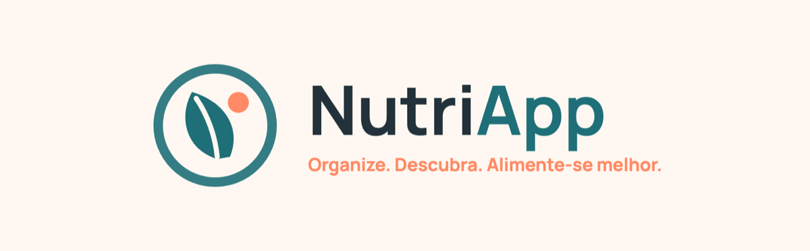
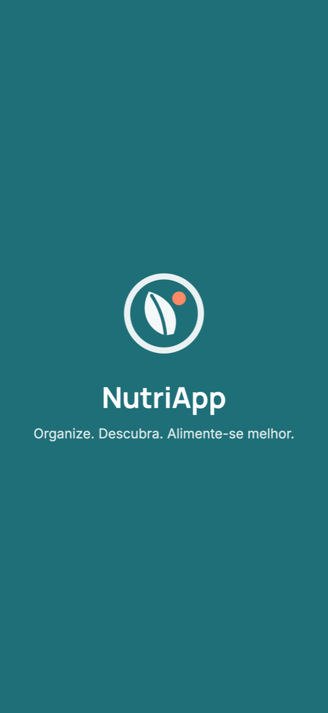
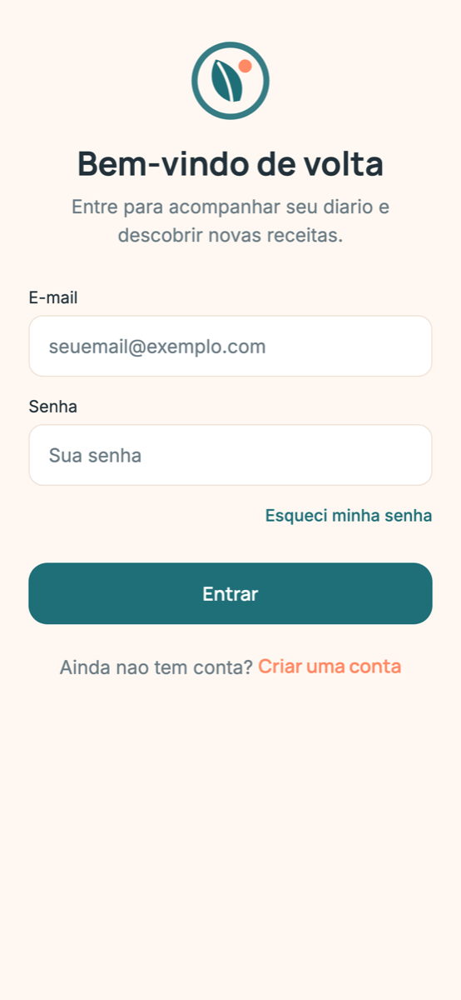
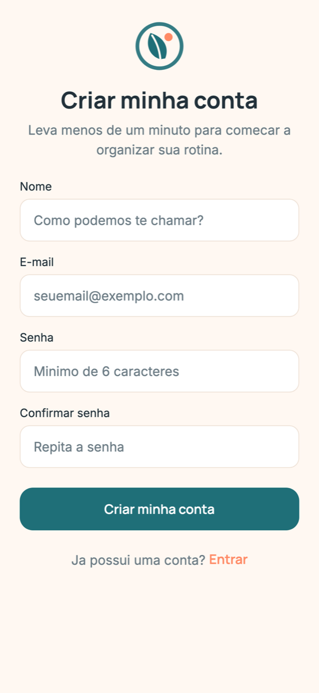
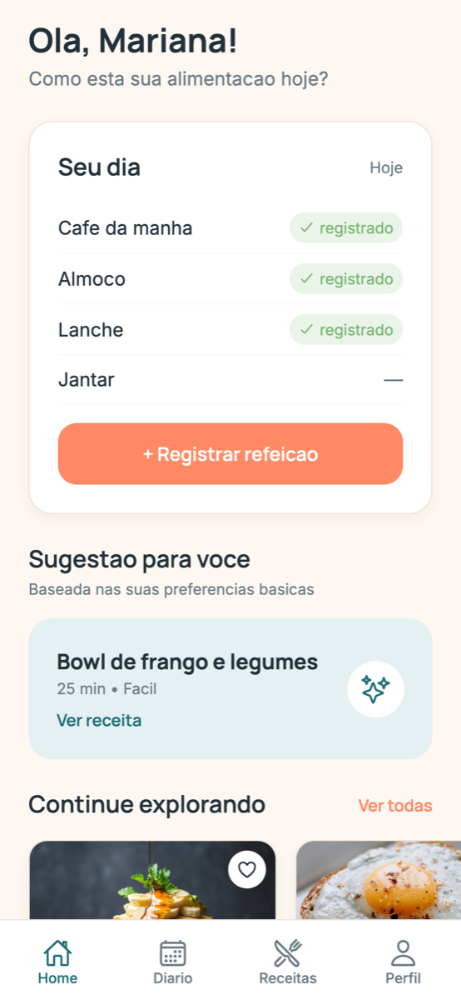
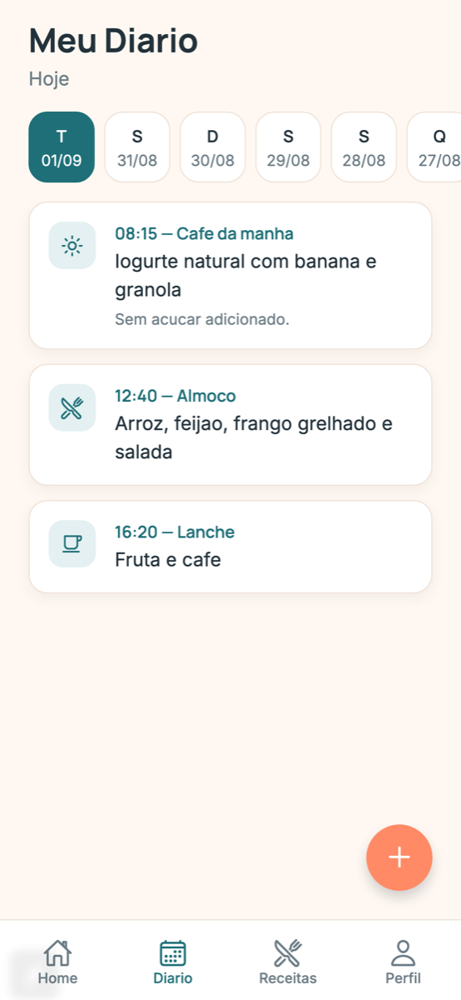
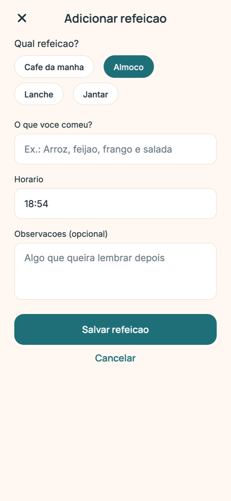
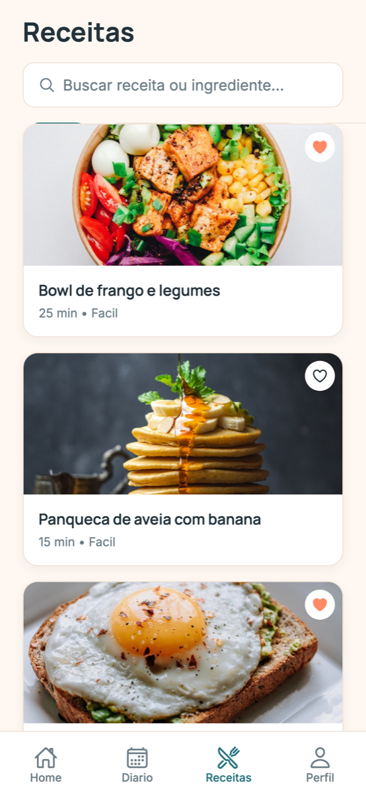
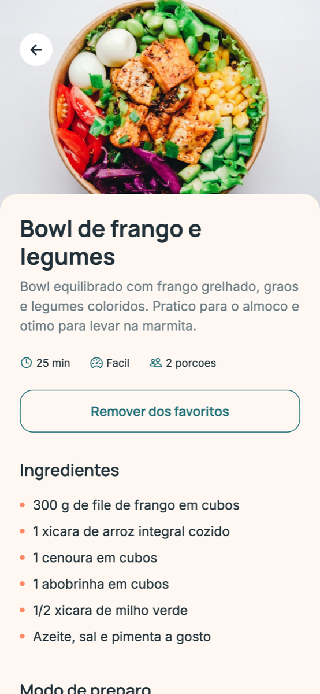
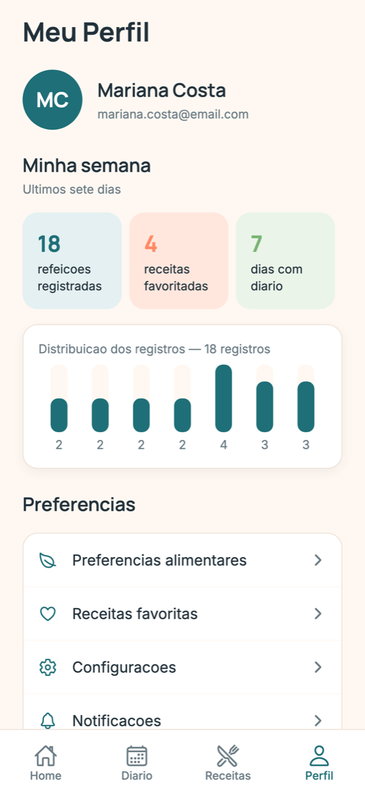

<div align="center">



**Diário alimentar com sugestões de receitas saudáveis**

`Checkpoint atual: CP4 — Idealização`

Projeto desenvolvido para a disciplina **Mobile Development & IoT** — FIAP

</div>

---

## 📱 Sobre o projeto

O **NutriApp** é um aplicativo mobile criado para facilitar a organização da rotina alimentar.

A aplicação combina um **diário de refeições** com uma área dedicada à **descoberta de receitas saudáveis e práticas**, permitindo que o usuário registre sua alimentação e encontre inspiração para as próximas refeições dentro de uma mesma experiência.

**Slogan:** “Organize. Descubra. Alimente-se melhor.”

**Proposta de valor:** “Sua rotina alimentar organizada. Sua próxima refeição inspirada.”

---

## 🎯 Objetivo

Criar uma experiência mobile simples e intuitiva que permita aos usuários registrar refeições, acompanhar seu histórico alimentar e encontrar receitas compatíveis com suas preferências.

O NutriApp valoriza **organização e construção de hábitos**, sem limitar sua proposta a uma experiência baseada apenas em contagem de calorias.

---

## ❗ Problema

Pessoas com rotinas acadêmicas e profissionais movimentadas enfrentam dificuldades como:

- falta de organização alimentar;
- dificuldade para lembrar as refeições realizadas;
- indecisão sobre o que preparar;
- dificuldade para variar as refeições;
- receitas espalhadas entre diferentes plataformas;
- ingredientes disponíveis em casa sem ideias de utilização;
- pouco tempo para planejamento.

---

## 💡 Solução

O NutriApp reúne em um único aplicativo o ciclo completo:

**Registrar → Acompanhar → Descobrir → Preparar**

O usuário registra suas refeições, consulta o histórico, visualiza sua semana, encontra receitas e salva as favoritas. Em evoluções futuras, o histórico e as preferências poderão apoiar sugestões ainda mais personalizadas.

---

## 🖼️ Telas

| Splash | Login | Cadastro |
|:---:|:---:|:---:|
|  |  |  |

| Home | Diário | Adicionar refeição |
|:---:|:---:|:---:|
|  |  |  |

| Receitas | Detalhes da receita | Perfil |
|:---:|:---:|:---:|
|  |  |  |

> As capturas acima foram geradas a partir da própria aplicação em execução.

---

## 🚀 Funcionalidades

### MVP

| # | Funcionalidade | Descrição | Status no CP4 |
|---|---|---|---|
| 1 | Cadastro e login | Criação e acesso à conta | Interface e validações |
| 2 | Perfil | Informações básicas e preferências | Interface |
| 3 | Home | Resumo do dia e atalhos | Funcional (mock) |
| 4 | Diário alimentar | Refeições organizadas por data | Funcional (mock) |
| 5 | Adicionar refeição | Categoria, descrição, horário e observações | Funcional (mock) |
| 6 | Histórico | Consulta dos registros anteriores | Funcional (mock) |
| 7 | Receitas | Catálogo organizado | Funcional (mock) |
| 8 | Pesquisa | Busca por nome ou ingrediente | Funcional (mock) |
| 9 | Filtros | Rápidas, vegetarianas e por refeição | Funcional (mock) |
| 10 | Detalhes da receita | Ingredientes, preparo e informações nutricionais | Funcional (mock) |
| 11 | Favoritos | Salvar receitas para acesso posterior | Funcional (mock) |
| 12 | Resumo semanal | Quantidade e distribuição dos registros | Funcional (mock) |

> No CP4 os dados vêm da pasta `mocks/`. A persistência real está prevista para o CP6.

### Evoluções futuras

- recomendações personalizadas;
- receitas baseadas em ingredientes disponíveis;
- lista de compras;
- planejamento semanal;
- notificações;
- insights avançados;
- integração com APIs externas de receitas;
- integração com dispositivos inteligentes.

---

## 🎨 Identidade visual

| Cor | Hex | Uso |
|---|---|---|
| Azul Nutri | `#1F6F78` | Cor primária, botões, navegação e identidade |
| Coral Vital | `#FF8A65` | CTAs, destaques e elementos interativos |
| Creme Natural | `#FFF8F2` | Fundo principal |
| Grafite | `#22313A` | Textos principais |
| Verde Equilíbrio | `#79B473` | Confirmações e estados positivos |
| Amarelo Energia | `#F4C95D` | Indicadores e pequenos destaques |

**Tipografia:** `Manrope` para títulos, botões e destaques • `Inter` para textos e descrições.

**Protótipo no Figma:** [Replicate NutriApp Project](https://www.figma.com/make/GOXcKuvqwGUppKVO95wxkT/Replicate-NutriApp-Project?fullscreen=1)

Detalhes completos em [`docs/Identidade_Visual_NutriApp.md`](docs/Identidade_Visual_NutriApp.md).

---

## 🛠️ Tecnologias

- React Native `0.86`
- Expo SDK `57`
- TypeScript
- Expo Router (navegação baseada em arquivos)
- React Hooks
- react-native-svg (logo vetorial)
- Google Fonts — Manrope e Inter
- Git, GitHub e Figma

Durante a prototipação são utilizados dados mockados.

---

## 📁 Estrutura

```
NutriApp/
│
├── app/                      # Rotas e telas (Expo Router)
│   ├── _layout.tsx           # Layout raiz e carregamento de fontes
│   ├── index.tsx             # Splash Screen
│   ├── (auth)/               # login.tsx e cadastro.tsx
│   ├── (tabs)/               # home, diario, receitas e perfil
│   ├── refeicao/             # adicionar.tsx
│   └── receita/              # [id].tsx
│
├── assets/                   # Imagens, fontes, ícones e logo
├── components/               # Componentes reutilizáveis do design system
├── constants/                # Cores, tipografia e espaçamentos
├── hooks/                    # Hooks personalizados
├── services/                 # Acesso e manipulação de dados
├── mocks/                    # Dados fictícios da prototipação
├── types/                    # Interfaces TypeScript
├── utils/                    # Funções auxiliares
├── docs/                     # Documentação acadêmica
├── design/                   # Link do Figma e previews das telas
│
├── app.json
├── package.json
├── tsconfig.json
└── README.md
```

| Pasta | Responsabilidade |
|---|---|
| `app/` | Rotas e telas da aplicação |
| `assets/` | Imagens, fontes, ícones e logo |
| `components/` | Componentes reutilizáveis |
| `constants/` | Tokens do design system |
| `hooks/` | Hooks personalizados e lógica reutilizável |
| `services/` | Camada de dados (mocks hoje, API no futuro) |
| `mocks/` | Dados fictícios utilizados na prototipação |
| `types/` | Interfaces TypeScript |
| `utils/` | Funções auxiliares |
| `docs/` | Documentação acadêmica |
| `design/` | Link e materiais do Figma |

---

## ⚙️ Como executar

### Pré-requisitos

- Node.js LTS
- Git
- Expo Go ou ambiente de emulação
- VS Code (recomendado)

### Clone

```bash
git clone https://github.com/3ESPG/nutriapp-mobile-iot.git
```

### Entre na pasta

```bash
cd nutriapp-mobile-iot
```

### Instale as dependências

```bash
npm install
```

### Inicie o Expo

```bash
npx expo start
```

Depois, leia o QR Code com o **Expo Go** ou utilize as opções do terminal:

| Tecla | Ação |
|---|---|
| `a` | Abre no emulador Android |
| `i` | Abre no simulador iOS (macOS com Xcode) |
| `w` | Abre a versão web |

### Verificação de tipos

```bash
npm run lint
```

---

## 👥 Integrantes

**Grupo:** GELO E LIMÃO

| Integrante | RM | Função |
|---|---|---|
| Felipe Braunstein e Silva | RM554483 | Documentação e escopo |
| Felipe do Nascimento Fernandes | RM554598 | Arquitetura e setup técnico |
| Henrique Ignacio Bartalo | RM555274 | Identidade visual e marca |
| Gustavo Henrique Martins | RM556956 | Pitch e modelo de negócio |

> A idealização do produto — problema, público-alvo, personas e proposta de valor — foi construída em conjunto pelo grupo. As funções acima indicam a **responsabilidade principal** de cada integrante na condução de cada frente.

---

## 🗺️ Roadmap

### ✅ CP4 — Idealização (atual)

Definição do problema, público, personas, proposta de valor, escopo, funcionalidades, identidade visual, conceito do logo, telas, pitch, modelo de negócio, arquitetura, setup inicial e documentação.

### ⏭️ CP5 — Prototipação

Refinamento das telas, navegação completa, ampliação dos componentes reutilizáveis, dados mockados, fluxo de diário, catálogo de receitas e favoritos.

### ⏳ CP6 — Entrega

Persistência dos dados, integração dos recursos, refinamento visual, testes, correções, build final e APK instalável.

---

## 📡 IoT — Evoluções futuras

Possíveis integrações futuras: smartwatches, balanças inteligentes, dispositivos de saúde, sensores e dispositivos conectados de cozinha.

Qualquer integração deverá observar autorização, finalidade do dado, segurança, armazenamento, privacidade e legislação aplicável.

> Essas integrações **não fazem parte do MVP nem dos requisitos do CP4**.

---

## 📌 Status

`Checkpoint atual: CP4 — Idealização`

- 🟢 Conceito definido
- 🟢 Escopo definido
- 🟢 Identidade visual definida
- 🟢 Arquitetura planejada
- 🟢 Documentação inicial preparada
- 🟢 Setup técnico executado e navegação inicial funcionando
- 🟡 Prototipação completa prevista para o CP5
- ⚪ Aplicativo final / APK previsto para o CP6

---

## 📄 Documentação

| Documento | Conteúdo |
|---|---|
| [Escopo](docs/Escopo_NutriApp.md) | Problema, público, personas, objetivos, MVP e fora do MVP |
| [Identidade Visual](docs/Identidade_Visual_NutriApp.md) | Marca, logo, paleta, tipografia, design system e telas |
| [Pitch e Modelo de Negócio](docs/Pitch_Modelo_Negocio_NutriApp.md) | Pitch, freemium, planos e projeção de preços |
| [Checklist do CP4](docs/Checklist_CP4.md) | Rastreio dos requisitos da rubrica |

---

<div align="center">

**NutriApp** — Sua rotina alimentar organizada. Sua próxima refeição inspirada.

</div>
