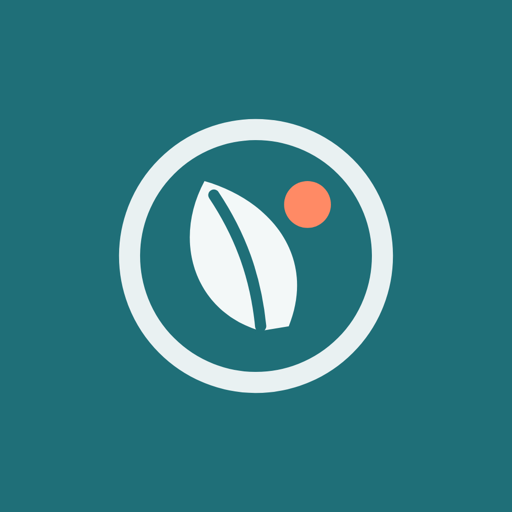

# Identidade Visual — NutriApp

**Disciplina:** Mobile Development & IoT — FIAP  
**Checkpoint:** CP4 — Idealização  
**Grupo:** GELO E LIMÃO

| Integrante | RM | Função |
|---|---|---|
| Felipe Braunstein e Silva | RM554483 | Documentação e escopo |
| Felipe do Nascimento Fernandes | RM554598 | Arquitetura e setup técnico |
| Henrique Ignacio Bartalo | RM555274 | Identidade visual e marca |
| Gustavo Henrique Martins | RM556956 | Pitch e modelo de negócio |

---

## 1. Logo

O logo do NutriApp possui três aplicações:

| Aplicação | Descrição | Arquivo |
|---|---|---|
| **Logo principal** | Símbolo + palavra NutriApp | `assets/logo/nutriapp-logo.svg` |
| **Logo reduzido** | Apenas o símbolo | `assets/logo/nutriapp-symbol.svg` |
| **Ícone** | Símbolo claro centralizado sobre fundo azul-petróleo | `assets/icon.png` |

O símbolo também está implementado como componente React Native em [`components/Logo.tsx`](../components/Logo.tsx), utilizando `react-native-svg`. Isso garante nitidez em qualquer tamanho e permite a variação `inverse` para aplicação sobre fundos escuros.

---

## 2. Conceito do logo

O símbolo é formado pela união visual de uma **folha minimalista** com o **contorno simplificado de um prato**.

Ao lado da folha, um pequeno **ponto circular** em coral representa simultaneamente:

- o alimento;
- o ponto de registro no diário;
- um elemento de interface digital.

A combinação representa os três pilares da marca: **alimentação + equilíbrio + tecnologia**.

**Formato.** Símbolo compacto com geometria arredondada, o que permite utilização em ícone do aplicativo, splash screen, avatar, redes sociais, documentação, favicon e materiais acadêmicos.

**Estilo.** Minimalista, flat, com poucos elementos, sem degradês obrigatórios e com boa legibilidade em tamanhos pequenos.

### Prompt utilizado para geração por IA

> Crie uma identidade visual e um logo vetorial minimalista para um aplicativo mobile chamado “NutriApp”, um diário alimentar integrado a sugestões de receitas saudáveis.
>
> O símbolo deve unir de maneira inteligente e simples o conceito de uma folha orgânica com um prato ou recipiente circular, incorporando um pequeno elemento visual que remeta a tecnologia ou registro digital.
>
> O resultado precisa funcionar perfeitamente como ícone de aplicativo para Android e iOS.
>
> Estilo moderno, flat design, premium e amigável. Evitar visual médico, academia, balança corporal, coração com eletrocardiograma, garfo e faca excessivamente óbvios ou muitos detalhes.
>
> Utilizar como cores principais azul-petróleo `#1F6F78` e coral `#FF8A65`, podendo utilizar fundo creme `#FFF8F2`.
>
> Tipografia moderna, arredondada e limpa.
>
> Criar versões: 1. símbolo; 2. símbolo + NutriApp; 3. ícone quadrado de aplicativo com cantos arredondados.
>
> Fundo limpo, sem mockups e sem elementos decorativos adicionais.

---

## 3. Nome

**NutriApp** — combina os conceitos de **nutrição** e **aplicativo**. Curto, fácil de pronunciar e imediatamente relacionado ao propósito do produto.

---

## 4. Slogan

> **“Organize. Descubra. Alimente-se melhor.”**

O slogan representa as três principais etapas da experiência:

- **Organize:** diário alimentar.
- **Descubra:** sugestões de receitas.
- **Alimente-se melhor:** consequência de uma rotina mais organizada.

---

## 5. Conceito da marca

A identidade do NutriApp busca equilibrar **saúde, tecnologia, acolhimento, simplicidade, praticidade e modernidade**.

O aplicativo **não** deve possuir aparência hospitalar, clínica ou excessivamente esportiva. Seu visual precisa transmitir que alimentação saudável pode fazer parte da rotina cotidiana sem tornar-se complicada.

**Posicionamento.** Organização alimentar acessível, para pessoas comuns com rotinas ocupadas — e não uma ferramenta clínica ou de alta performance esportiva.

---

## 6. Paleta de cores

| Cor | Hex | Utilização |
|---|---|---|
| **Azul Nutri** | `#1F6F78` | Cor primária, botões, navegação e identidade |
| **Coral Vital** | `#FF8A65` | CTAs, destaques e elementos interativos |
| **Creme Natural** | `#FFF8F2` | Fundo principal |
| **Grafite** | `#22313A` | Textos principais |
| **Verde Equilíbrio** | `#79B473` | Confirmações e estados positivos |
| **Amarelo Energia** | `#F4C95D` | Indicadores e pequenos destaques |

### Estratégia visual

- O azul-petróleo assume o protagonismo para evitar uma identidade genérica composta apenas por verde.
- O verde continua presente, mas como cor funcional ligada a equilíbrio e estados positivos.
- O coral acrescenta personalidade e proximidade.

### Tons de apoio implementados

Além das seis cores oficiais, o código define variações de apoio em [`constants/colors.ts`](../constants/colors.ts) para superfícies, bordas e estados: `primaryLight`, `secondaryLight`, `successLight`, `accentLight`, `surface`, `border` e `textMuted`.

---

## 7. Tipografia

### Fonte principal — Manrope

Utilização: títulos, números, cards, botões e destaques.
Pesos: **Bold 700**, **SemiBold 600** e **Medium 500**.

### Fonte secundária — Inter

Utilização: textos, descrições, formulários e informações menores.

### Hierarquia

| Estilo | Fonte | Tamanho |
|---|---|---|
| Título principal | Manrope Bold | 28 px |
| Título de seção | Manrope SemiBold | 22 px |
| Subtítulo | Manrope Medium | 18 px |
| Corpo | Inter Regular | 16 px |
| Legenda | Inter Regular | 13/14 px |
| Botão | Manrope SemiBold | 16 px |

As duas famílias oferecem alta legibilidade em interfaces digitais e possuem estilo contemporâneo. A hierarquia está implementada em [`constants/typography.ts`](../constants/typography.ts).

---

## 8. Design System

### Tokens

| Token | Valores | Arquivo |
|---|---|---|
| Cores | 6 cores oficiais + tons de apoio | `constants/colors.ts` |
| Tipografia | 6 estilos e 6 famílias/pesos | `constants/typography.ts` |
| Espaçamento | 4 / 8 / 16 / 24 / 32 / 48 | `constants/spacing.ts` |
| Raio | 8 / 12 / 16 / 20 / pill | `constants/spacing.ts` |
| Sombra | Sombra discreta padrão de card | `constants/spacing.ts` |

### Diretrizes de interface

- **Cantos:** cards e botões com bordas arredondadas entre 12 e 20 px.
- **Espaçamento:** sistema baseado em múltiplos de 8 (8, 16, 24 e 32 px).
- **Ícones:** traços simples e arredondados (biblioteca Ionicons).
- **Fotografias:** imagens reais de alimentos, iluminação natural e composições simples.
- **Cards:** fundos claros, sombras discretas e informações hierarquizadas.

### Componentes

| Componente | Descrição | Estados |
|---|---|---|
| `Button` | Botão do design system | `primary`, `secondary`, `outline`, `ghost`, pressionado, desabilitado, carregando |
| `Input` | Campo de formulário com rótulo | padrão, foco, erro, texto de apoio, multilinha |
| `Chip` | Filtro do catálogo e seletor de categoria | padrão, selecionado, pressionado |
| `MealCard` | Registro do diário, com ícone por categoria | padrão, pressionado |
| `RecipeCard` | Card de receita com foto e favorito | lista, horizontal, favoritado, imagem indisponível |
| `SectionTitle` | Cabeçalho de seção com ação opcional | com e sem ação |
| `StatCard` | Indicador numérico do resumo semanal | `primary`, `secondary`, `success`, `accent` |
| `EmptyState` | Estado vazio reutilizável | com e sem ação |
| `ScreenContainer` | Base visual de todas as telas | padrão, `flush` |
| `Logo` | Símbolo vetorial da marca | `default`, `inverse` |

Todos os componentes ficam em [`components/`](../components) e consomem exclusivamente os tokens de `constants/`, garantindo consistência entre as telas.

---

## 9. Telas conceituais

As nove telas abaixo foram capturadas da própria aplicação em execução (viewport 390 × 844).

### 9.1 Splash Screen
Apresenta a marca durante a inicialização: logo, nome e slogan sobre o azul-petróleo.

### 9.2 Login
E-mail, senha, botão **Entrar**, link de recuperação de senha e acesso ao cadastro.

### 9.3 Cadastro
Nome, e-mail, senha, confirmação de senha e botão **Criar minha conta**.

### 9.4 Home
Saudação personalizada, card **Seu dia** com as quatro categorias, CTA **+ Registrar refeição**, sugestão de receita e carrossel **Continue explorando**.

### 9.5 Diário Alimentar
Cabeçalho **Meu Diário**, seletor de datas dos últimos sete dias, cards das refeições registradas e botão flutuante para novo registro.

### 9.6 Adicionar refeição
Seleção de categoria, descrição do que foi consumido, horário, observações opcionais e botão **Salvar refeição**.

### 9.7 Receitas
Campo de busca, filtros horizontais e cards com fotografia, título, tempo, dificuldade e favorito.

### 9.8 Detalhes da receita
Imagem principal, nome, tempo, dificuldade, porções, botão de favoritar, ingredientes, modo de preparo numerado e informações nutricionais com aviso de caráter informativo.

### 9.9 Perfil / Progresso
Avatar, nome, seção **Minha semana** com indicadores e distribuição dos registros, lista de preferências e botão **Editar perfil**.

### 9.10 Bottom Tab Navigation

Quatro abas: **Home** (casa), **Diário** (calendário), **Receitas** (prato) e **Perfil** (usuário).

O botão de adicionar refeição fica disponível na Home e por um botão flutuante no Diário, evitando uma quinta aba desnecessária.

### Prompt utilizado para geração das telas no Figma/IA

> Crie um protótipo mobile completo em alta fidelidade para um aplicativo chamado “NutriApp”, um diário alimentar integrado a sugestões de receitas saudáveis e práticas. Considerar aproximadamente 390 × 844 px por tela, seguindo padrões modernos de aplicativos iOS e Android.
>
> **Identidade:** Primary `#1F6F78`, Secondary `#FF8A65`, Background `#FFF8F2`, Text `#22313A`, Success `#79B473`, Accent `#F4C95D`. Manrope para títulos, botões e destaques; Inter para corpo de texto.
>
> **Estilo visual:** moderno, minimalista, acolhedor, clean, premium; cards com cantos arredondados; ícones lineares; bastante espaço em branco; fotografias naturais de alimentos; interface clara e intuitiva.
>
> **Evitar:** interface hospitalar; estética fitness agressiva; excesso de verde; telas congestionadas; gráficos excessivamente técnicos.
>
> **Telas:** Splash Screen; Login; Cadastro; Home; Diário Alimentar; Adicionar refeição; Receitas; Detalhes da Receita; Perfil/Progresso; e Bottom Tab Navigation com Home, Diário, Receitas e Perfil.
>
> Garantir consistência total de componentes, cores, tipografia, grid, espaçamento e ícones entre todas as telas. Criar também um pequeno Design System contendo cores, tipografia, botões, inputs, cards, chips, ícones e estados dos componentes.

---

## 10. Link do Figma

Protótipo: [Replicate NutriApp Project](https://www.figma.com/make/GOXcKuvqwGUppKVO95wxkT/Replicate-NutriApp-Project?fullscreen=1)

O link também está registrado em [`design/link-figma.txt`](../design/link-figma.txt), junto dos dados da equipe.

As previews de todas as telas estão em [`design/previews/`](../design/previews).
